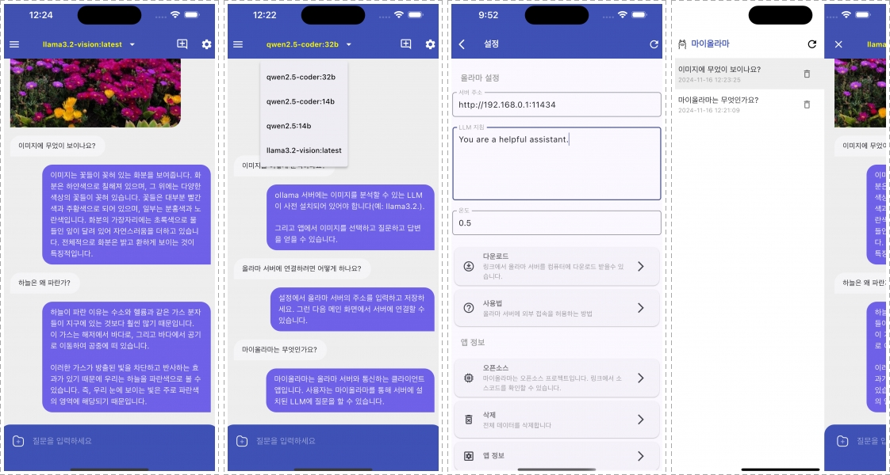

# MyOllama: Ollama 기반 LLM 모바일 클라이언트

MyOllama는 Ollama가 설치된 컴퓨터에 접속하여 대규모 언어 모델(LLM)과 상호작용할 수 있는 모바일 클라이언트 앱입니다. 소스코드를 다운받아 빌드 하거나 [애플 앱스토어](https://apps.apple.com/us/app/my-ollama/id6738298481)에서 MyOllama 앱을 다운로드할 수 있습니다.

## 소개

MyOllama를 사용하면 무료로 다양한 오픈 소스 LLM을 활용할 수 있습니다. Ollama 프로그램을 통해 자신의 컴퓨터에서 LLM을 실행하므로, 별도의 사용료 없이 AI 모델과 대화할 수 있습니다.

## 주요 기능

- 원격 LLM 접속: IP 주소를 통해 Ollama 호스트에 연결
- 커스텀 프롬프트: 사용자 정의 Instruction 설정 지원
- 다양한 오픈 소스 LLM 지원 (Llama, Gemma, Qwen, Mistral 등)
- 사용자 정의 Instruction 설정 가능
- 이미지 인식 기능 지원 (해당 기능을 지원하는 모델에 한함)
- 직관적인 채팅 형식의 UI
- 대화 기록: 채팅 세션 저장 및 관리
- iOS와 Android 지원
- 한국어, English, 日本語를 지원

## 사용 방법

1. Ollama를 컴퓨터에 설치합니다 (macOS, Windows, Linux 지원). Ollama 설치 방법은 [Ollama GitHub](https://ollama.com/download)에서 확인할 수 있습니다.
2. 소스를 다운 받아서 Flutter를 이용하여 빌드하거나, [App Store](https://apps.apple.com/us/app/my-ollama/id6738298481)에서 MyOllama 앱을 다운로드합니다.
3. Ollama에 원하는 모델을 설치합니다. [모델다운로드](https://ollama.com/search)
4. Ollama를 원격 접속이 가능하도록 설정을 변경합니다. 참조: [링크](http://practical.kr/?p=809) 
5. MyOllama 앱을 실행하고 Ollama가 설치된 컴퓨터의 IP 주소를 입력합니다.
6. 원하는 AI 모델을 선택하고 대화를 시작합니다.

## 시스템 요구사항

- Ollama가 설치된 컴퓨터
- 네트워크 연결

## 장점

- 이 앱은 오픈소스 LLM을 효율적으로 활용하고자 하는 개발자 및 연구자를 위해 설계되었습니다. API 호출, 프롬프트 엔지니어링, 모델 성능 테스트 등 다양한 기술적 실험에 활용 가능합니다.
- 무료로 고급 AI 기능 사용 가능
- 다양한 LLM 모델 지원
- 프라이버시 보호 (로컬 컴퓨터에서 실행)
- 프로그래밍, 창의적 작업, 일상적인 질문 등 다양한 용도로 활용 가능

## 주의사항

- 이 앱을 사용하려면 반드시 Ollama가 설치된 컴퓨터가 필요합니다.
- Ollama 호스트 설정 및 관리는 사용자 책임입니다. 보안 설정에 유의하세요.

## 라이선스

MyOllama는 GNU 라이선스를 따릅니다. 자세한 내용은 [LICENSE](LICENSE) 파일을 참조해 주세요.

## 연락처

MyOllama에 대한 문의나 버그 신고는 rtlink.park@gmail.com 으로 메일을 보내주세요.
