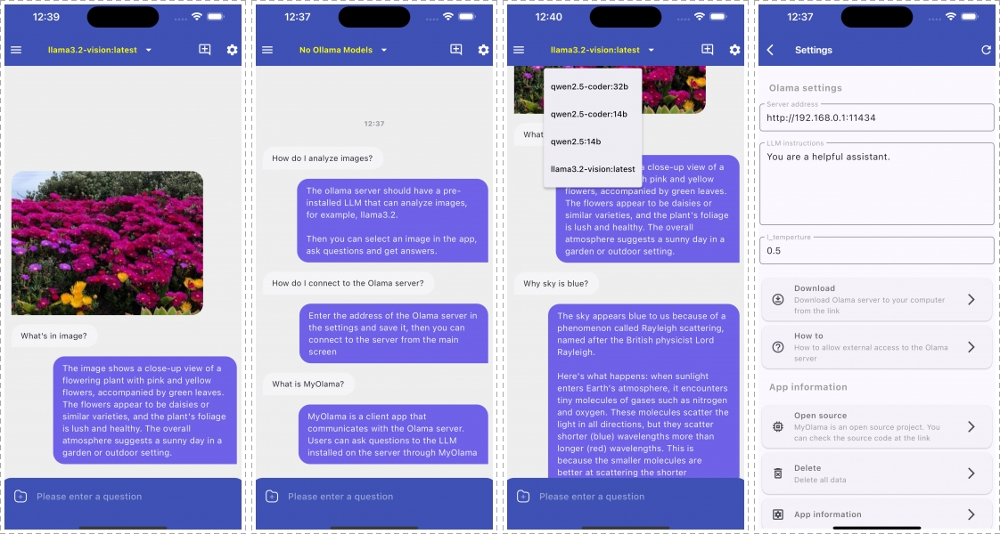

# ✨ MyOllama ✨

_Ollama-based LLM mobile client_

[한국어](./README_KR.md) •
[日本語](./README_JP.md)

# MyOllama

MyOllama is a mobile client app that allows you to connect to a computer with Ollama installed and interact with the Large Language Model (LLM). You can download and build the source code or download the MyOllama app from the [Apple App Store](https://apps.apple.com/us/app/my-ollama/id6738298481).

## Introduction

Ollama is open source software that makes it easy to run Large Language Models (LLMs) on your local machine.
You can use MyOllama to access Ollama and utilize various LLMs. MyOllama - Run LLMs on your own computer through the Ollama program, so you can talk to AI models without paying a fee.

## Key features

- Remote LLM access: Connect to the Ollama host via IP address
- Custom prompts: support for setting custom instructions
- Supports various open source LLMs (Llama, Gemma, Qwen, Mistral, etc.)
- Customizable instruction settings
- Supports image recognition (only on models that support it)
- Intuitive chat-like UI
- Conversation history: save and manage chat sessions
- Supports iOS and Android
- Supports Korean, English, and Japanese
- Support Markdown format
- Support iPad, Mac Desktop

## How to use

1. Install Ollama on your computer (macOS, Windows, Linux supported). You can see how to install Ollama on [Ollama GitHub](https://ollama.com/download).
2. Download the source and build it with Flutter, or download the MyOllama app from the [App Store](https://apps.apple.com/us/app/my-ollama/id6738298481).
3. Install the desired model in Ollama. [Download model](https://ollama.com/search)
4. Change the settings to make Ollama remotely accessible. See: [link](http://practical.kr/?p=809) 
5. Launch the MyOllama app and enter the IP address of the computer where Ollama is installed.
6. Select the desired AI model and start a conversation.

## System requirements

- Computer with Ollama installed
- Network connection

## Advantages

- This app is designed for developers and researchers who want to efficiently utilize open-source LLMs. It can be utilized for various technical experiments such as API calls, prompt engineering, model performance testing, etc.
- Advanced AI features available for free
- Supports a wide range of LLM models
- Privacy-protected (runs on your local machine)
- Versatile for programming, creative work, casual questions, etc.
- Organized to keep conversations in context

## Notes

- This app requires a computer with Ollama installed.
- You are responsible for setting up and managing your Ollama host. Be aware of security settings.

## Download App 

- For those who have difficulty building, you can download the app from the link below.
- [https://apps.apple.com/us/app/my-ollama/id6738298481](https://apps.apple.com/us/app/my-ollama/id6738298481)

## License

MyOllama is licensed under the GNU license. For more information, please refer to the [LICENSE](LICENSE) file.

## Contact

For questions or bug reports about MyOllama, please send an email to rtlink.park@gmail.com.

