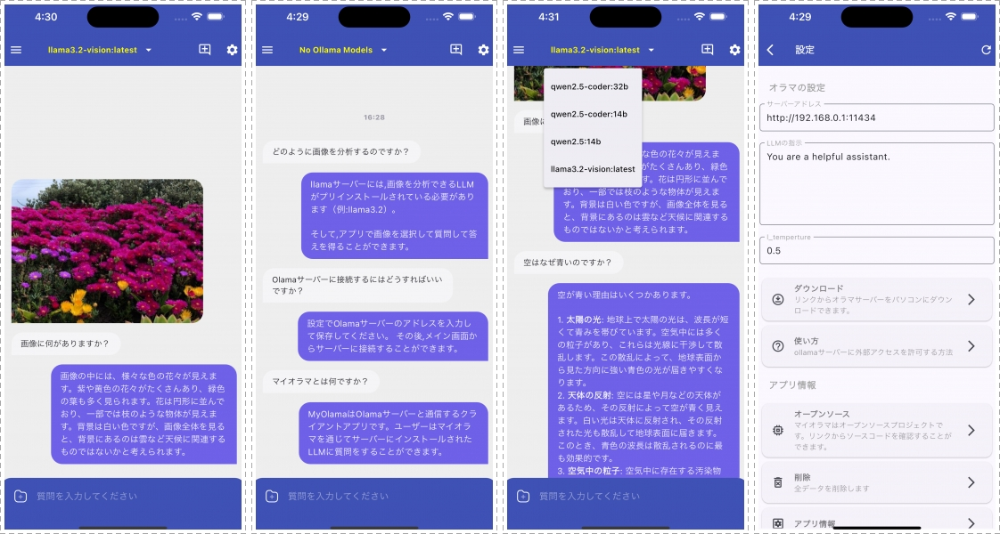
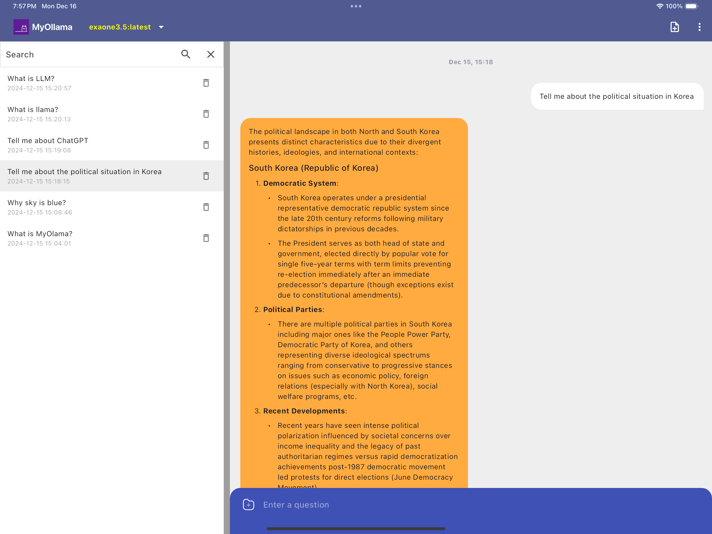

# ✨ マイオラマ ✨

_OllamaベースのLLMモバイルクライアント_

[ENGLISH](./README.md) •
[한국어](./README_KR.md) 

# MyOllama

MyOllamaは、Ollamaがインストールされたコンピュータに接続し、大規模言語モデル(LLM)と対話できるモバイルクライアントアプリです。ソースコードをダウンロードしてビルドするか、[アップルアプリストア](https://apps.apple.com/us/app/my-ollama/id6738298481)からMyOllamaアプリをダウンロードすることができます。

## 紹介

Ollamaは大規模言語モデル(Large Language Models, LLMs)をローカルコンピュータで簡単に実行できるようにするオープンソースソフトウェアです。
MyOllamaを使用してOllamaに接続し、様々なLLMを活用することができます。MyOllama - Ollamaプログラムを通じて自分のコンピュータでLLMを実行するので、別途使用料なしでAIモデルと対話することができます。

## 主な機能

- リモートLLM接続：IPアドレスでOllamaホストに接続します。
- カスタムプロンプト: ユーザー定義のInstruction設定サポート
- 様々なオープンソースLLMをサポート(Llama, Gemma, Qwen, Mistralなど)
- ユーザー定義のInstruction設定可能
- 画像認識機能をサポート(該当機能をサポートするモデルに限る)
- 直感的なチャット形式のUI
- 会話記録：チャットセッションの保存と管理
- iOSとAndroidをサポート
- 韓国語、English、日本語をサポート

## 使い方

1. Ollamaをパソコンにインストールします(macOS、Windows、Linuxをサポート)。Ollamaのインストール方法は[Ollama GitHub](https://ollama.com/download)で確認することができます。
2. ソースをダウンロードしてFlutterを使ってビルドするか、[App Store](https://apps.apple.com/us/app/my-ollama/id6738298481)からMyOllamaアプリをダウンロードします。
3. Ollamaに好きなモデルをインストールします。[モデルダウンロード](https://ollama.com/search)
4. Ollamaをリモートアクセスができるように設定を変更します。参照ください： [リンク](http://practical.kr/?p=809) 
5. MyOllamaアプリを実行し、OllamaがインストールされているコンピュータのIPアドレスを入力します。
6. 希望のAIモデルを選択して会話を開始します。

## システム要件

- Ollamaがインストールされているコンピュータ
- ネットワーク接続

## 利点

- このアプリは、オープンソースのLLMを効率的に活用したい開発者や研究者向けに設計されています。API呼び出し、プロンプトエンジニアリング、モデルの性能テストなど、様々な技術的な実験に活用できます。
- 無料で高度なAI機能を使用可能
- 様々なLLMモデルをサポート
- プライバシー保護 (ローカルコンピュータで実行)
- プログラミング、クリエイティブな作業、日常的な質問など、様々な用途に活用できます。
- 会話の文脈を継続できるように構成

## 注意事項

- このアプリを使用するには、必ずOllamaがインストールされたコンピュータが必要です。
- Ollamaホストの設定と管理はユーザーの責任で行ってください。セキュリティ設定にご注意ください。

## アプリのダウンロード 

- ビルドが難しい方は下記のリンクからアプリをダウンロードすることができます。
- [https://apps.apple.com/kr/app/my-ollama/id6738298481](https://apps.apple.com/kr/app/my-ollama/id6738298481)

## ライセンス

MyOllamaはGNUライセンスに従います。詳細は[LICENSE](LICENSE)ファイルを参照してください。

## お問い合わせ

MyOllamaに関するお問い合わせやバグ報告は rtlink.park@gmail.com までメールを送ってください。

DeepL.com（無料版）で翻訳しました。
